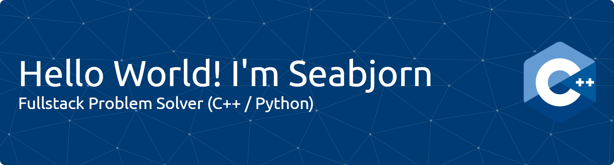

## Hi there! I'm Seabjorn👋

<!--
**seabjorn/seabjorn** is a ✨ _special_ ✨ repository because its `README.md` (this file) appears on your GitHub profile.

Here are some ideas to get you started:

- 🔭 I’m currently working on ...
- 🌱 I’m currently learning ...
- 👯 I’m looking to collaborate on ...
- 🤔 I’m looking for help with ...
- 💬 Ask me about ...
- 📫 How to reach me: ...
- 😄 Pronouns: ...
- ⚡ Fun fact: ...
-->

##### Hi there! my name is Seabjorn, I'm just a student who likes doing computer experiments😶‍🌫️

##### I code with

##### Connect with me
 

##### My Github Stats

- 🔭 **I’m currently working on:**  
  Developing high-performance backend systems and low-level services using **C++**, **C**, and **Python** — focusing on **efficiency**, **concurrency**, and **system reliability**.

- 🌱 **I’m currently learning:**  
  Advanced topics in **systems programming**, **memory management**, **multithreading**, and **distributed computing**.  
  I’m also exploring **Rust** for its strong safety guarantees and performance edge.

- 👯 **I’m looking to collaborate on:**  
  Projects involving **large-scale backend infrastructures**, **real-time data processing**, or **high-performance computing systems** that push hardware to its limits.

- 🤔 **I’m interested in:**  
  Optimizing complex algorithms for **performance-critical environments** and mastering **cross-platform development techniques**.

- 💬 **Ask me about:**  
  Backend architecture in **C/C++**, **Python API frameworks (FastAPI, Flask)**,  
  database optimization (**PostgreSQL, Redis**), **socket programming**, and **performance profiling**.

  

<h2 align="left">I code with</h2>

###

<picture>
  <source media="(prefers-color-scheme: dark)" srcset="https://raw.githubusercontent.com/seanbjorn/seanbjorn/output/pacman-contribution-graph-dark.svg">
  <source media="(prefers-color-scheme: light)" srcset="https://raw.githubusercontent.com/seanbjorn/seanbjorn/output/pacman-contribution-graph.svg">
  
</picture>

###

###
